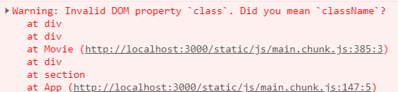

# Nomad Coder : Making Movie App using react

## 1.6 

- [x] setState를 호출 할 때마다 render()를 호출한다.

    - 1.11 
        
        **setState()는 비동기로 처리된다고 하는데, 이에대한 예시를 찾아보고 어떻게 실행되는지 결과를 구해보자.(미해결)**

- [x] 클래스 컴포넌트로 구성할 때, 반드시 상태의 변수명을 state라고 선언해야하는가? 
    ```javascript
    그런듯 하다. 다음 코드는 ReaComponent 중 setState가     기술되어있는 부분이다.

    setState<K extends keyof S>(
    state: ((prevState: Readonly<S>, propReadonly<P>)   => (Pick<S, K> | S | nu) | (Pick<S, K> | S |      null),
    callback?: () => void
    ): void;
    ``` 

    - 1.11

        찾아보니 원래 state를 쓰려면 constructor에서 선언을 해줘야 쓸 수 있었다고 한다. 


- [x] state를 선언할 떄 var 또는 let으로 형태를 선언하지 않는 이유는? 

    ```javascript
        Unexpected token. A constructor, method, accessor, or property was expected.ts(1068)
    ```

- [ ] class 내부에 있는 메서드는 함수 선언 없이 가능한데, 그 이유는 무엇일까?

- [x] 아래처럼 코드짜지 마쇼

```javascript

    increasecount = () =>{
        this.setState(current => ({count : current.count+1}))
    }
    
    this.state 대신에 current라는 인자를 사용하자.
    react에서 외부의 상태에 의존하지 않는 가장 좋은 방법이래 ( 무슨 소리일까)

```

## LIFE CYCLE

- 리액트가 컴포넌트를 생성하거나 없애는 방법

### Mounting
[마운팅의 의미를 알아보자](https://stackoverflow.com/questions/31556450/what-is-mounting-in-react-js)

```
The main job of React is to figure out how to modify the DOM to match what the components want to be rendered on the screen.

React does so by "mounting" (adding nodes to the DOM), "unmounting" (removing them from the DOM), and "updating" (making changes to nodes already in the DOM).
```

사용되는 메서드

    - constructor() : 자바스크립트에서 클래스 만들 때

    - static getDerivedStateFromProps() --> 수업에서는 안다루니 개인적으로 찾아보기

    constructor에 있는 hello --> render에 있는 hi

    - constructor에 들어가는 props의 정체는 무엇인고
    - super() : 자바에서와 비슷하게 부모 객체를 부르는 역할을 합니다. 다시말해서, super(props)는 부모의 constructor에 props라는 인자를 넣어서 실행하는 것을 의미하는 것이..겠지...?
    
    - componentDidMount() : 컴포넌트가 마운트 되었어! 
        

### Updating
기본적으로 setState를 발생시킬때 나타남

    - componentDidupdate()


### Unmounting

    - componentWillUnmount()


## Fetching Data

- Axios


- 3항연산자 

    ```javascript
    isLoading ? "Loading" :"We are ready"
    isLoading이 true이면 Loading, false이면 뒤에것.
    ```

- 비구조화 할당 (구조 분해)

    ```javascript
        const { isLoading } = this.state

        isLoading을 곧바로 쓸 수 있음
        this.state.isLoading 이렇게 안 써도 된다.

        
        json 구조도 비 구조화 할당 가능
        const {data:{data:{movies}}} = await axios.get("https://yts-proxy.nomadcoders1.now.sh/list_movies.json");

        --> 곧바로 moives 사용 가능

    


    ```    

- 동작 방식

    ```javascript
    componentDidMount(){
      setTimeout(()=>{
        this.setState({isLoading : false});
      },3000);
    }

    render() --> componentDidMount() --> setTimeout() --> setState() --> render()
    ```


## Style Component

오우 쥐엔장...JSX에서 곧바로 style태그를 !

BEM Naming 어떤 컴포넌트에서 무슨 역할을 하는지 ex ) card__title-primary


## PropTypes

얘 확인하기.
genres : PropTypes.arrayOf(PropTypes.string).isRequired


## 1.11

- current 사용방법 익히기

- setState(updater, callback)
        
    - call back 함수 이후 render이 됩니다. state를 여기서 체크해주면 되는걸까?


- 음 글자 길이가 100자가 넘으면 줄이고 싶은데, 이걸 app component에서 처리할까? 아니면 Movie component에서 처리할까?

    APP에서는 접근이 불가한듯?

Movie.js에서 하면 자르는 부분을 함수로 빼는것이 좋을까? (굳이 조건문을 써서 할 필요가 없었다.)

img가운데 정렬 text도 되네?

spinner 참고 사이트
[Spinner](https://projects.lukehaas.me/css-loaders/)

리액트로 슬라이더 만들어보기. (css로는 안되나?)

엥 이에러는 쩌지 



## 1.12

- class 컴포넌트 말고 Hook을사용해보자.

    - useState 함수는 하나의 상태값만 관리 가능. 여러개면 여러개의 useState를 사용하면 된다.

    - 근데 그럼 다른 함수에서는 건드리지 못하겠네...? 
      
      - 함수 컴포넌트 내부에 함수를 또 정의해서 건드릴 수 있겠다. 근데 함수로서 실행하면 실행컨텍스트 문제가 생기려나? --> 직접해보자. 
      - 함수 컴포넌트에서는 this가 필요 없나...?
      - 맨날 헷갈리는 null vs undefined

- Why Hook? 

    - 함수형 컴포넌트에서는 원래 state를 다룰 수 없었는데, Hook을 통해서 이를 가능하게 함.
    
    - 내장 Hook , Custom Hook 
        
        - useState : 상태관리를 위한 Hook
        - useEffect : 리액트 컴포넌트가 렌더링 될 때마다 특정 작업을 수행하도록 설정하는 Hook (componentDidMount와 componentDidUpdate를 합친 형태)

            - 마운트 될 때만 실행하고 싶을 때 (compoenntDidMount) : useEffect의 두번째 인자에 빈 배열을 넣자.
            - 업데이트 될 때만 실행하고 싶을 때 (componentDidUpdate) : useEffect의 두번째 인자에 업데이트 되는 값을 넣자.

            - clean up (뒷정리 함수) : 컴포넌트가 언마운트 되기 전이나 업데이트 되기 직전에 어떠한 작업을 수행하고 싶다면 useEffect에서 뒷정리 함수를 반환해 주어야 한다.

                ```javascript
                    useEffect(()=>{
                        console.log("effect");
                        console.log(name);
                        return () =>{
                            console.log('clean up');
                            console.log(name);
                        }
                    }) 
                
                토막 js 문법
                    논리 AND (&&)	expr1 && expr2	expr1을 true로 변환할 수 있는 경우 expr2을 반환하고, 그렇지 않으면 expr1을 반환합니다.

                ```


            - clean up을 이용하지 않는 Effects

                - 리액트가 DOM을 업데이트한 뒤 추가로 코드를 실행하야 하는 경우
        - useReducer
        - useMemo
        - useCallback
        - useRef

